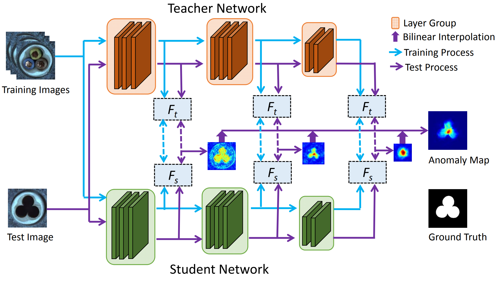
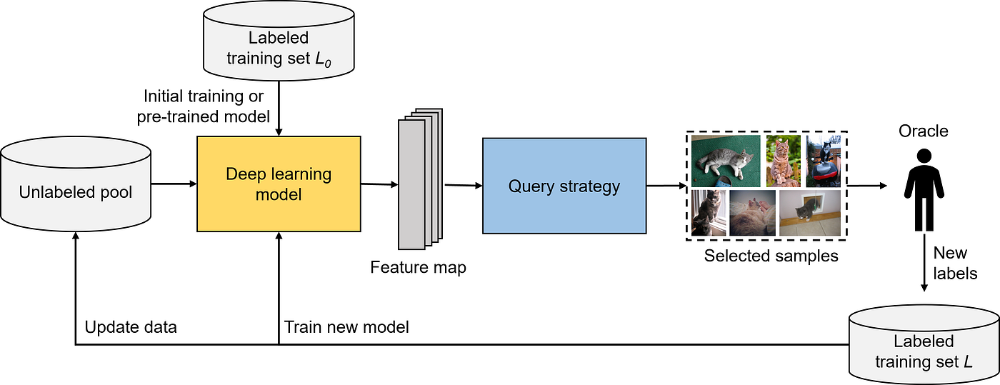

# UAADF : Unsupervised Anomaly Detection Framework 
- Anomaly Detection Framework for Fully unsupervised learning 
- Using Active learning query strategy for Data Refinement
- Now ongoing 


# Environments

NVIDIA pytorch docker [ [link](https://docs.nvidia.com/deeplearning/frameworks/pytorch-release-notes/rel-22-12.html#rel-22-12) ]

```bash
docker pull nvcr.io/nvidia/pytorch:22.12-py3
```

`requirements.txt`

```bash
accelerate==0.18.0
wandb
torchvision==0.15.0a0
gradio==3.27.0
omegaconf
timm==0.9.2
seaborn
easydict 
pyDantic
```
# Run 
```bash
anomaly_ratio='0 0.05 0.1 0.15'
query_strategy='entropy_sampling random_sampling margin_sampling least_confidence'
class_name='leather zipper metal_nut wood pill grid tile capsule hazelnut toothbrush screw carpet bottle cable all'

for q in $query_strategy
do
    for r in $anomaly_ratio
    do
        for c in $class_name
        do
            echo "query_strategy: $q, anomaly_ratio: $r, class_name: $c"
            python main.py --default_setting configs/benchmark/default_setting.yaml \
                        --strategy_setting configs/benchmark/$q.yaml \
                        DATASET.anomaly_ratio $r \
                        DATASET.params.class_name $c
        done
    done
done


```

# Methods
- 전체 데이터(Normal + Anomaly)로 Anomaly Detection 모델을 학습하며 Active Learning의 query strategy를 이용해 Uncertainty가 높은 데이터를 제외, 이를 반복하여 최종적으로 Normal data로만 Anomaly Detection 모델 학습 
- Anomaly Detection 모델로는 Student Teacher Anomaly Detection 방법론인 `STPM`을 사용 
- 다만 Uncertainty를 계산하기 위해선 softmax logit 값이 필요하기 때문에 SimCLR의 contrastive learning module 추가해서 사용 
- query strategy는 `Entropy Sampling` 사용 
- Motivated by Jaehyuk Heo's Seminar

## Assumption 
- Assumption 1 : Anomaly Ratio가 높을 수록 학습 성능은 악화될 것이다. 
- Assumption 2 : Uncertainty가 높은 것은 Anomaly Data일 것이다. 
- Assumption 3 : Round를 거치며 Query strategy를 통해 높은 Uncertainty를 가진 데이터를 제외하면 최종적으로 온전한 normal data만으로 학습이 가능할 것이다. 

## Framework 
- Active Learning의 Query strategy를 이용한 Anomaly Detection Framework 
- 처음엔 Normal과 Anomaly가 합쳐진 데이터로 모델 학습 시작 
- 학습한 모델을 이용해 학습 데이터의 Uncertainty를 계산 
- 이 중 Uncertainty가 가장 높은 K개를 제외 
- K개를 제외한 나머지 데이터를 이용해 다시 학습 진행 
- 위 과정 반복 

- 학습 과정 
    - 처음엔 모든 데이터를 가지고 학습을 진행 
    - 학습 된 모델을 가지고 학습 데이터에 대해 Uncertainty를 계산 

## Backgrounds 
<p align='center'>

- **STPM** 
    - Student Teacher 구조의 Anomaly Detection 방법론 
    - 고정 된 Pretrained Teacher와 동일한 구조의 Student로 구성 
    - Student는 Teacher에서 나온 Pyramid feature와의 차이를 최소화 하도록 학습 
    - Teacher와 Student 간의 distance를 Anomaly Score로 사용 


<p align='center'>

- **Active Learning**
    - 학습 방법 중 하나로 소수의 라벨 데이터와 대량의 언라벨 데이터가 있다는 가정 하에 학습 진행 
    - 라벨 데이터로 모델을 학습한 뒤, 학습한 모델을 이용해 언라벨 데이터 중 라벨링 할 대상 선정 
    - 언라벨 데이터 중 대상을 선정하는 과정에서 query strategy 사용 
    - 대표적인 방법으로 Uncertainty를 계산하는 것으로, 모델이 확신을 가지지 못하는 것에 대해 라벨링 요청 
    - Uncertainty 방법론으로는 `Entropy`, `Least Confidence`, `Margin Confidence` 등이 있음 

## Baseline
`./models`
- STPM : https://arxiv.org/abs/2103.04257
- SimCLR : https://arxiv.org/abs/2002.05709

## Query Strategy 
`./query_strategies`

- ~~Random Sampling~~
- Entropy Sampling


# Result 

[result.ipynb](result.ipynb)

# Feedback 
- **평가 데이터셋**
    - anomaly ratio에만 집중한 나머지 test 데이터셋을 고정하지 못 했음 → anomaly ratio가 바뀜에 따라 test set 도 바뀌어서 공정한 비교가 되지 못 함
- **불완전한 학습**
    - 30epoch으로 학습을 진행 했는데 학습이 완전히 수렴되지 않은 상태로 끝난 것으로 보임
- **베이스라인의 온전한 구축**
    - 기존 세팅 대로 온전히 학습 된 것을 확인하고 이후 실험을 진행 했어야 했는데 그러지 못 함
    - 기본 성능 자체가 너무 낮게 나옴
    - 그리고 베이스라인에서 일부 모듈을 수정했기 때문에 성능 또한 온전히 재현 될 것이라는 보장이 안됌
    - simclr의 한계 → 높은 batch size 요구
        - but 사용한 데이터 수가 적음
- **일부 class 누락**
    - bash 파일에서 잘못해서 일부 class 누락 됨
